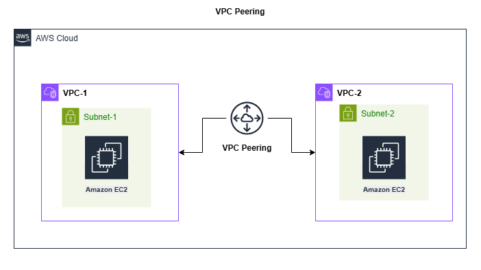

# AWS VPC Peering Project

This project demonstrates how to set up VPC Peering between two Virtual Private Clouds (VPCs) in AWS.

## Architecture Diagram

## Steps

### 1. Create Two VPCs
- VPC-1: CIDR `192.168.0.0/16`
- VPC-2: CIDR `172.16.0.0/16`

### 2. Create Subnets with Auto-assign Public IP
- VPC-1 Subnet: `192.168.1.0/24`
- VPC-2 Subnet: `172.16.1.0/24`

### 3. Internet Gateways
- Create and attach IGW to both VPCs.

### 4. VPC Peering
- Request from VPC-1 to VPC-2.
- Accept in VPC-2.

### 5. Route Tables
- VPC-1 routes to `172.16.0.0/16` and `0.0.0.0/0`
- VPC-2 routes to `192.168.0.0/16` and `0.0.0.0/0`

### 6. Security Groups
- Allow ICMP from opposite VPC CIDRs.

### 7. IAM Role for SSM
- Create role `SSM-EC2-Role` with `AmazonSSMManagedInstanceCore` policy.

### 8. Launch EC2 Instances
- One in each VPC, assign security group and IAM role.

### 9. Test Connectivity
- Use ping between instances in both VPCs to validate peering.

---

This setup allows secure and private communication between EC2 instances across VPCs.
